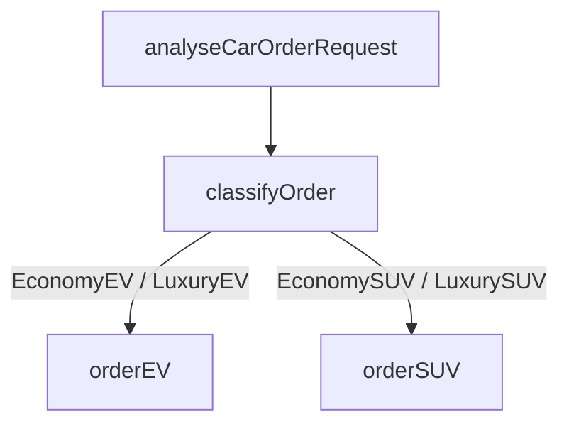

# Car Dealership Agentlang Model

This module demonstrates how **Agentlang** can automate a car dealership workflow — from analyzing a customer’s free-text request to classifying the type of vehicle and finally creating an order for the right car model (EV or SUV).

---

## Overview

The **`order.core`** module models two categories of vehicles — Electric Vehicles (EV) and Sport Utility Vehicles (SUV) — and provides intelligent agents that can:

1. **Understand customer requests** using natural language.
2. **Infer missing details** (such as battery type or transmission).
3. **Classify the order** as one of several predefined types (EconomyEV, LuxurySUV, etc.).
4. **Automatically create the vehicle record** in the system.

---

## Entities and Records

### `BaseEV` and `EV`

Define attributes for electric vehicles including body color, battery pack, charger, and market segment.

```agentlang
record BaseEV { bodyColor String, batteryPack @enum("59kwh", "79kwh"), charger @enum("11.2kw", "7.2kw") }
entity EV extends BaseEV { id UUID @id @default(uuid()), segment @enum("economy", "luxury") }
```

### `BaseSUV` and `SUV`

Define attributes for fuel-based vehicles, covering transmission type, fuel type, torque, and segment.

```agentlang
record BaseSUV { bodyColor String, transmission @enum("manual", "automatic"), fuel @enum("diesel", "petrol"), torque @enum("330nm", "380nm") }
entity SUV extends BaseSUV { id UUID @id @default(uuid()), segment @enum("economy", "luxury") }
```

### `CarOrderRequest`

A schema representing structured order details inferred from customer messages.

---

## Agents and Intelligence

### `analyseCarOrderRequest`

An agent that **interprets customer messages** and returns structured order data based on natural language cues.

It uses multiple **directives** to fill in missing fields:

* Default battery and charger for EVs
* Default transmission, fuel, and torque for SUVs
* Default color (`white`) when unspecified

**Example Scenarios:**

* “I am looking for a high-end electric car. My favorite color is red”
  → `{carType "EV", bodyColor "red", batteryPack "79kwh", charger "11.2kw", segment "luxury"}`

* “I am looking for an affordable, fuel-efficient SUV”
  → `{carType "SUV", bodyColor "white", transmission "manual", fuel "petrol", torque "330nm"}`

---

### `orderEV` and `orderSUV`

Agents that create instances of the corresponding entities:

* `orderEV` — Creates EV orders
* `orderSUV` — Creates SUV orders

Each agent uses **parameter substitution** to create vehicles based on analyzed request data.

---

### `classifyOrder`

A **decision block** that classifies the structured request into one of four categories:

* `EconomyEV`
* `LuxuryEV`
* `EconomySUV`
* `LuxurySUV`

This classification determines which agent will process the final order.

---

### `carOrderRequestManager`

A **public orchestration agent** that connects all the logic into a declarative workflow:



This agent:

* Parses the customer request.
* Infers details and classifies it.
* Automatically creates the car order.

---

## Workflows

The flow `carOrderRequestManager` ties together:

* `analyseCarOrderRequest`
* `classifyOrder`
* `orderEV` and `orderSUV`

Depending on classification results, the appropriate entity creation workflow is triggered.

---

## Sample Requests

### 1. Place an EV order

```shell
curl -X POST http://localhost:8080/order.core/carOrderRequestManager \
  -H 'Content-Type: application/json' \
  -d '{"message": "I want to order a luxury electric vehicle"}'
```

### 2. Place an SUV order

```shell
curl -X POST http://localhost:8080/order.core/carOrderRequestManager \
  -H 'Content-Type: application/json' \
  -d '{"message": "I need a diesel SUV with automatic transmission. preferred color is black"}'
```

---

## View Orders

After execution, view the created entities:

```shell
curl http://localhost:8080/order.core/EV
curl http://localhost:8080/order.core/SUV
```

---

## 💡 Key Concepts Demonstrated

| Concept                            | Description                                          |
| ---------------------------------- | ---------------------------------------------------- |
| **Declarative Decisioning**        | Uses `decision` blocks for car type classification   |
| **Compositional Schema**           | Uses `record` inheritance for shared attributes      |
| **Defaulting via Directives**      | Infers missing details automatically                 |
| **Natural Language Orchestration** | Agents interpret and act on free-form customer input |
| **Automated CRUD Workflows**       | Agents generate entity instances declaratively       |

---

### 🧠 Summary

The `order.core` module illustrates how **Agentlang** bridges natural language intent with structured automation.
By combining agents, directives, decisions, and workflows, the dealership can move from *customer chat* to *order fulfillment* — automatically, declaratively, and intelligently.
